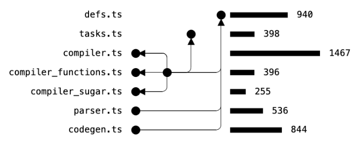

<br />
<div align="center">
  <a href="https://github.com/JakeCoxon/radius">
    
  </a>

  <h3 align="center">Programming language</h3>

  <p align="center" style="padding:0 100px">
    Experimental, statically typed, low level language with high level features. I want to use it for graphics and audio. But expect almost nothing to work yet.
    <br />
  </p>
</div>


```python

fn main():
  my_list := [1, 2, 3, 2, 1]
  for x in my_list:
    print(foo(x))

fn foo(x: int) -> int:
  x * 32
```

## Current features

* No external dependencies (except bun runtime) and less than 5000 lines of code.
* Static typing with generics - Sizes of structs are known at compile time so can compile to efficient staticly typed bytecode. One-way type inference, no automatic type conversions (except number literals)
* Currently compiles to custom statically typed VM bytecode but in the future other backends will hopefully be supported.
* Dynamic arrays and strings with size field and bounds checks
* Functions are templated and monomorphise to independent functions like C++ templates (rather than Java generics)
* Out of order compilation - implemented using a custom task system and queue where tasks can be paused and resumed
* [Experimental web debugger](docs/debugger.md) - which lets you step through the compilation of a program and inspect every data struture used by the compiler, including the AST, compiled bytecode etc
* [Compile-time closure](docs/closures.md) - Closures that are firstclass at compile-time and are inlined at the callsite. They can be composed and passed around to compile-time functions
* [Internal iterators](docs/iterators.md) - very simple to implement, customisable iterator functions that for-loop uses
* [Transducers](docs/transducers.md) - Implemented as library functions which allow for composable, higher-order array operations
* [Metaprogramming AST](docs/compile_time.md) - AST manipulation at compile-time without macros, implemented using a builtin bytecode VM with instructions to create and manipulate AST objects
* [Vector value types using metaclasses](docs/metaclasses.md) - for 3d math with basic operator overloading
* Shorthand array operations - syntax sugar for mapping, zipping and reducing without higher order functions


<div align=center style="background:white"></div>
<div align=center><small>Dependency graph and line count of each file - total = 4836</small></div>


## Future goals / ideas

* Codegen targets such as Web Assembly, Javascript and GLSL can be implemented as a library function
* Manual memory management with no garbage collection. But try and avoid footguns by ensuring bounds checking and memory arenas. Maybe disallow pointer arithmetic completely. Maybe optional ref counting for in debug mode that can be completely removed in release mode
* Pattern matching of some kind
* The language doesn't have traditional function overloading but I want to include some higherorder function utilities.
* No OOP, but some kind of interfaces/traits system

## Compile time evaluation

Why is compile time evaluation so important? It can replace many features from other languages into a simpler system

* Configure how to integrate with the outside environment and platform
* Configure how to compile the program, with different compiler options based on environment
* Understand and modify types, classes, fields etc
* Reduce code repetition
* Emit code based on compile time information (including command line options)
* Type checking helpers
* Library and standard library functions that can be configured with no runtime overhead or external build tools
* Produce statistics, visualisations, debug info about program during compilation
* Macros to add syntax (Probably not worth it to be honest)
* Functional programming utilities
* Metacompile function definitions as function calls for potental speed?
* Compile-time closures
* Metaobject/metaclasses to customise object behaviour without any runtime overhead
* Editor/debugger integration?

These things are written in the same language as regular code, so can they can use the same standard library functions that regular code uses

## Non-traditional syntax

Let binding is done with `:=` with optional type in between

```python
foo := 2 + 3
bar : float = 3.1
```

---

Number literals have a special literal type that can be coerced to whatever type is needed

```python
foo := 2 + 3 # int
bar : float = 2 + 3 # float
baz := 3.1 + 1.2 # float
```

But non-literals must be cast manually

```python
foo : int = 2
bar : float = float(foo) + 2.1
```

This gives the best of both worlds where all types are checked, implicit conversions don't mess you up, and literals don't need to be annotated.

---

Function type parameters are defined using exclamation point

```python
fn my_function!(T)(param: T):
  ...

fn my_other_function!(A, B)():
  ...

fn main():
  my_function(100) # template params are inferred

  # If one type argument is passed then it doens't need a parenthesis
  my_function!int(100) 
  my_other_function!(f, 200)() # any compile time values can be passed
```

The same goes for type parameters

```python
type MyThing!(T):
  foo: T

fn main():
  thing := MyThing!int(123)
```


## Running

* Requires `bun`
* Install with `bun install`
* Run tests with `bun test`
* Experimental web interface using `bun web/server.ts`
