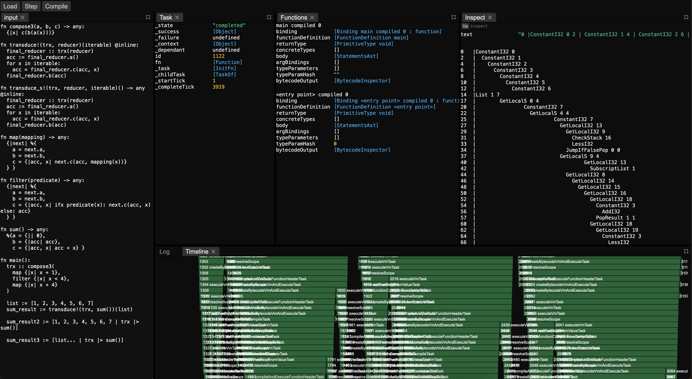

# Debugger

There is an experimental interface that runs in the browser. The idea is that you can inspect the **compilation** of the program. Since metaprogram is an important part of the language, this should be useful. You can step through each task or click compile to immediately compile the whole program.

The input tab allows you to edit the code and recompile. The timeline view shows every task and its dependency graph with the x-axis being time. Clicking any task allows you to inspect it and its values. All compiler data structures appear in blue can be clicked to inspect. The ASTs, internal VM bytecode and output bytecode are all available to be inspected

