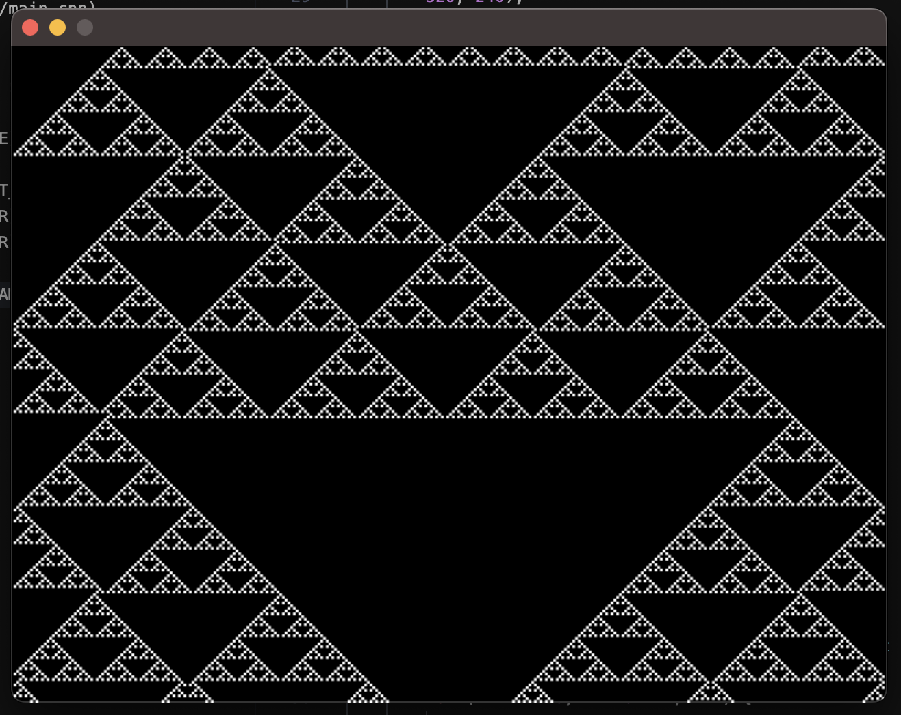
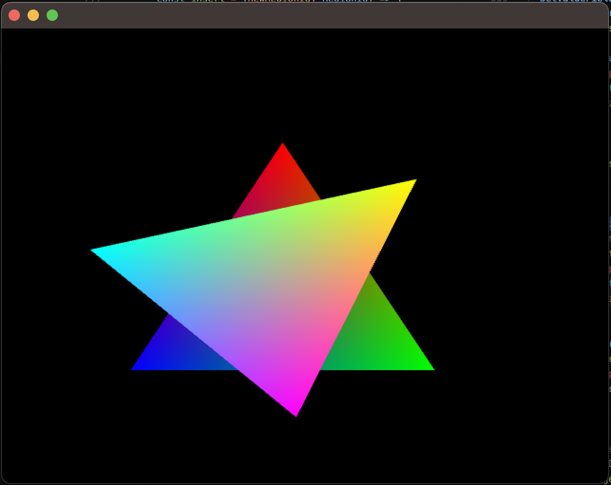
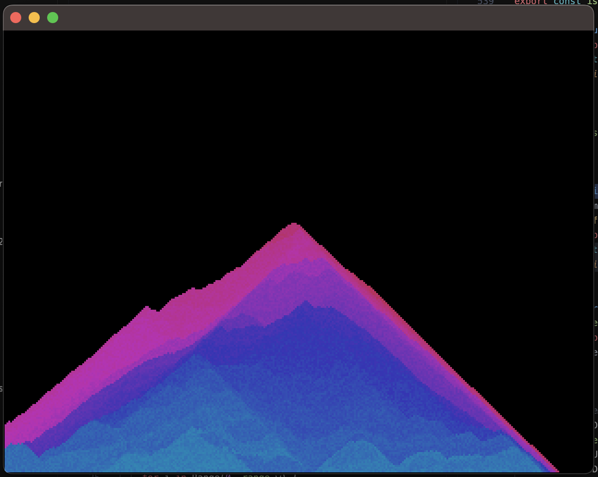

Currently this is a very basic proof-of-concept that uses SDL and a software allocated graphics buffer. But in the future I'd like to support a basic OpenGL wrapper that uses the builtin vector types

## Cellular automata example 



```rust
import compiler
import range for Range
import array for Array, array_create
import graphics for frame_ticks, copy_pixels, save, restore, set_fill_color, fill_rectangle, rotate, translate, draw_canvas_to_screen

// https://mathworld.wolfram.com/ElementaryCellularAutomaton.html
const rule_num = 126

const bsl = compiler.operator_bitshift_left
const bsr = compiler.operator_bitshift_right
const band = compiler.operator_bitwise_and

fn calculate_state(a: int, b: int, c: int) -> int {
  let index = bsl(a, 2) + bsl(b, 1) + c
  band(bsr(rule_num, index), 1)
}

const scale = 2
const num_cells = 320 / scale

var cells = array_create!int(num_cells)
var next_cells = array_create!int(num_cells)

fn init() @export {

  cells[:] = 0 ...
  cells[num_cells / 2] = 1

  set_fill_color(0, 0, 0, 1)
  fill_rectangle(0, 0, 320, 240)
}

fn frame() @export {

  copy_pixels(0, scale, 320, 240, 0, 0)

  for x in Range(1, num_cells - 1) {
    next_cells[x] = calculate_state(
      cells[x - 1], cells[x], cells[x + 1])
  }

  for x in Range(0, num_cells) {
    if next_cells[x] == 1 {
      set_fill_color(1, 1, 1, 1)
    } else {
      set_fill_color(0, 0, 0, 1)
    }
    
    fill_rectangle(scale * float(x), 240 - scale, scale, scale)
  }

  var swap = cells&
  cells = next_cells&
  next_cells = swap&

  draw_canvas_to_screen()

}

fn cleanup() @export {
  0
}

fn on_event() @export {
  0
}

```


## Triangles example

This shows how to draw using hardware accelerated graphics. Under the hood it uses [Sokol](https://github.com/floooh/sokol/) graphics for cross platform support. It has built in vector types, matrix operations and color types.



```rust

import vec for vec2
import color for rgb
import graphics for draw_defaults, begin_triangles, vertex, end_draw, translate3d, push_matrix, pop_matrix, rotate3d

const window_width = 320
const window_height = 240

var t = 0.0

fn frame() @export {
  draw_defaults()
  t += 1
  
  block {
    push_matrix()
    translate3d(sin(t * 0.01) * 0.1, 0, 0)
    
    begin_triangles()
    vertex(vec2( 0.0,  0.5), rgb(1, 0, 0))
    vertex(vec2(-0.5, -0.5), rgb(0, 0, 1))
    vertex(vec2( 0.5, -0.5), rgb(0, 1, 0))
    end_draw()
    pop_matrix()
  }

  block {
    push_matrix()
    rotate3d(t * 0.01, 0, 0, 1)
    
    begin_triangles()
    vertex(vec2( 0.0,  0.5), rgb(1, 1, 0))
    vertex(vec2(-0.5, -0.5), rgb(0, 1, 1))
    vertex(vec2( 0.5, -0.5), rgb(1, 0, 1))
    end_draw()
    pop_matrix()
  }
}

```

## Sand example



A more full example of a falling sand simulation with mouse interaction.

[../examples/sand.rad](../examples/sand.rad)