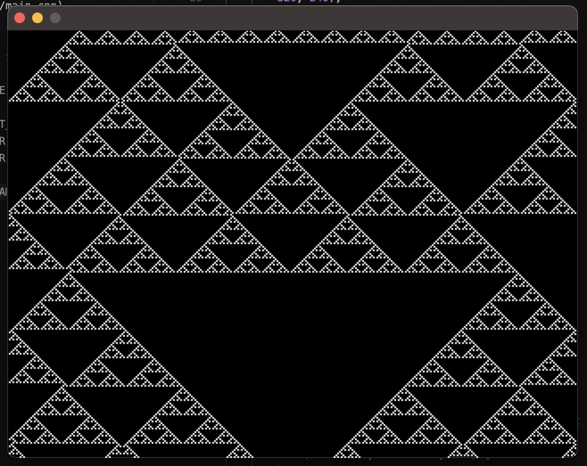

Currently this is a very basic proof-of-concept that uses SDL and a software allocated graphics buffer. But in the future I'd like to support a basic OpenGL wrapper that uses the builtin vector types

## Cellular automata example 



```python
import compiler
import range for Range
import array for Array, array_create
import gui for begin_app, end_app, window_open, render_app, frame_ticks, set_pixel, get_pixel, fill_rect, delay, copy_pixels

fn main():

  begin_app()

  scale :: 2
  num_cells :: 320 / scale

  cells := array_create!int(num_cells)
  next_cells := array_create!int(num_cells)

  cells[:] = 0 ...
  cells[num_cells / 2] = 1

  fill_rect(0, 0, 320, 240, 0)

  while window_open():

    copy_pixels(0, scale, 320, 240, 0, 0)

    for x in Range(1, num_cells - 1):
      next_cells[x] = calculate_state(
        cells[x - 1], cells[x], cells[x + 1])

    for x in Range(0, num_cells):
      c := ifx next_cells[x] == 1: 0xffffffff else: 0
      fill_rect(scale * x, 240 - scale, scale, scale, c)

    swap := cells
    cells = next_cells
    next_cells = swap

    render_app()
    delay(5)

  end_app()

# https://mathworld.wolfram.com/ElementaryCellularAutomaton.html
rule_num :: 126

bsl :: compiler.operator_bitshift_left
bsr :: compiler.operator_bitshift_right
band :: compiler.operator_bitwise_and

fn calculate_state(a: int, b: int, c: int) -> int:
  index := bsl(a, 2) + bsl(b, 1) + c
  band(bsr(rule_num, index), 1)

```